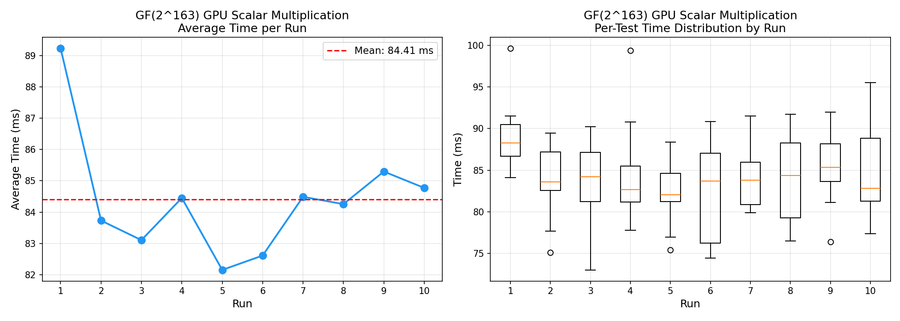
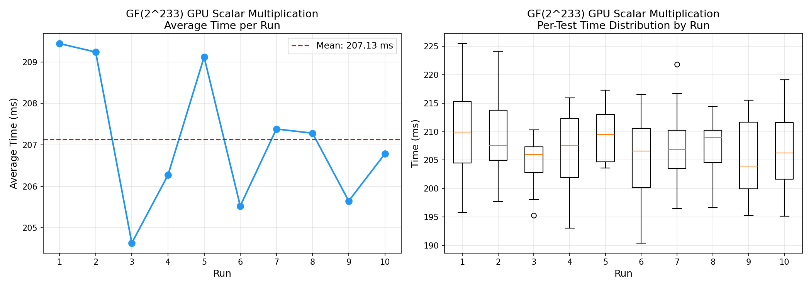

# GPU Elliptic Curve Scalar Multiplication over Binary Fields

**Author:** Salah Harb

GPU-accelerated implementations of elliptic curve scalar multiplication over binary extension fields GF(2^m) using the Lopez-Dahab projective coordinate system. All kernels are written in CUDA C and executed via [CuPy](https://cupy.dev/) on NVIDIA GPUs.

## Supported Curves

| Curve | Field | Irreducible Polynomial | Limb Representation |
|-------|-------|------------------------|---------------------|
| **sect163r2** | GF(2^163) | x^163 + x^7 + x^6 + x^3 + 1 | 3 x 64-bit |
| **sect233r1** | GF(2^233) | x^233 + x^74 + 1 | 4 x 64-bit |
| **sect571r1** | GF(2^571) | x^571 + x^10 + x^5 + x^2 + 1 | 9 x 64-bit |

All three curves follow the Koblitz/binary Weierstrass form: **y^2 + xy = x^3 + ax^2 + b**

## Implementation Details

### Architecture

Each implementation (`GPU_kernal_ecc_scalar_*.py`) contains:

1. **GF(2^m) Field Arithmetic (CUDA kernels)**
   - `gf2_mul64` - Carry-less 64-bit multiplication
   - `gf2_mult_*` - Full-width schoolbook multiplication with modular reduction
   - `gf2_square` - Squaring with bit-interleaving and modular reduction
   - `gf2_square_k` - Repeated squaring (k iterations)
   - `xor_shift` - XOR-shift helper for limb accumulation

2. **Elliptic Curve Operations (CUDA kernels)**
   - `point_double_*` - Lopez-Dahab point doubling in projective coordinates
   - `point_add_*` - Lopez-Dahab mixed point addition (affine base point, projective accumulator)
   - `scalar_mult_*` - Double-and-add scalar multiplication (MSB to LSB)

3. **Field Inversion (CUDA kernels)**
   - `gf2_inv_itoh_tsujii_*` - Itoh-Tsujii multiplicative inversion using addition chains specific to each field size

4. **Host-side Python**
   - Curve parameter setup and limb packing
   - Random scalar generation
   - Kernel compilation and launch via CuPy `RawModule`
   - Projective-to-affine coordinate conversion on GPU
   - Timing measurement with `time.perf_counter()` and CUDA synchronization

### Key Algorithms

- **Scalar Multiplication:** Binary double-and-add method scanning from MSB to LSB
- **Point Doubling:** Lopez-Dahab formula in projective (X, Y, Z) coordinates, avoiding expensive field inversions during the main loop
- **Point Addition:** Mixed addition where the base point is in affine coordinates (Z=1) and the accumulator is in projective coordinates
- **Field Inversion:** Itoh-Tsujii algorithm using optimized addition chains, applied only once at the end to convert the result back to affine coordinates

## File Structure

```
gpu_implementations/
  GPU_kernal_ecc_scalar_163.py      # GF(2^163) scalar multiplication kernel
  GPU_kernal_ecc_scalar_233.py      # GF(2^233) scalar multiplication kernel
  GPU_kernal_ecc_scalar_571.py      # GF(2^571) scalar multiplication kernel
  benchmark_163.py                  # Benchmark runner for GF(2^163)
  benchmark_233.py                  # Benchmark runner for GF(2^233)
  benchmark_571.py                  # Benchmark runner for GF(2^571)
  benchmark_163_statistics.txt      # GF(2^163) benchmark results
  benchmark_233_statistics.txt      # GF(2^233) benchmark results
  benchmark_571_statistics.txt      # GF(2^571) benchmark results
  benchmark_163_plot.png            # GF(2^163) performance plots
  benchmark_233_plot.png            # GF(2^233) performance plots
  benchmark_571_plot.png            # GF(2^571) performance plots
  README.md                         # This file
```

## Benchmark Results

Each benchmark runs the corresponding kernel **10 times** (each run performs multiple scalar multiplications with random scalars), collecting per-test GPU execution times.

**Test environment:** NVIDIA GeForce RTX 4060 (8 GB), CUDA 13.0

### Summary

| Field | Mean | Median | Std Dev | Min | Max | Tests per Run | Total Tests |
|-------|------|--------|---------|-----|-----|---------------|-------------|
| **GF(2^163)** | 84.41 ms | 84.22 ms | 5.21 ms | 73.03 ms | 99.63 ms | 10 | 100 |
| **GF(2^233)** | 207.13 ms | 207.10 ms | 6.45 ms | 190.40 ms | 225.50 ms | 15 | 150 |
| **GF(2^571)** | 898.12 ms | 892.99 ms | 27.52 ms | 857.59 ms | 1009.17 ms | 10 | 100 |

### Performance Plots

**GF(2^163):**


**GF(2^233):**


**GF(2^571):**


## Requirements

- Python 3.8+
- [CuPy](https://cupy.dev/) (`pip install cupy-cuda12x` for CUDA 12.x)
- NVIDIA GPU with CUDA support
- NumPy

## Usage

Run a single curve implementation:

```bash
python3 GPU_kernal_ecc_scalar_163.py
python3 GPU_kernal_ecc_scalar_233.py
python3 GPU_kernal_ecc_scalar_571.py
```

Run benchmarks (10 runs each, generates plots and statistics):

```bash
python3 benchmark_163.py
python3 benchmark_233.py
python3 benchmark_571.py
```
